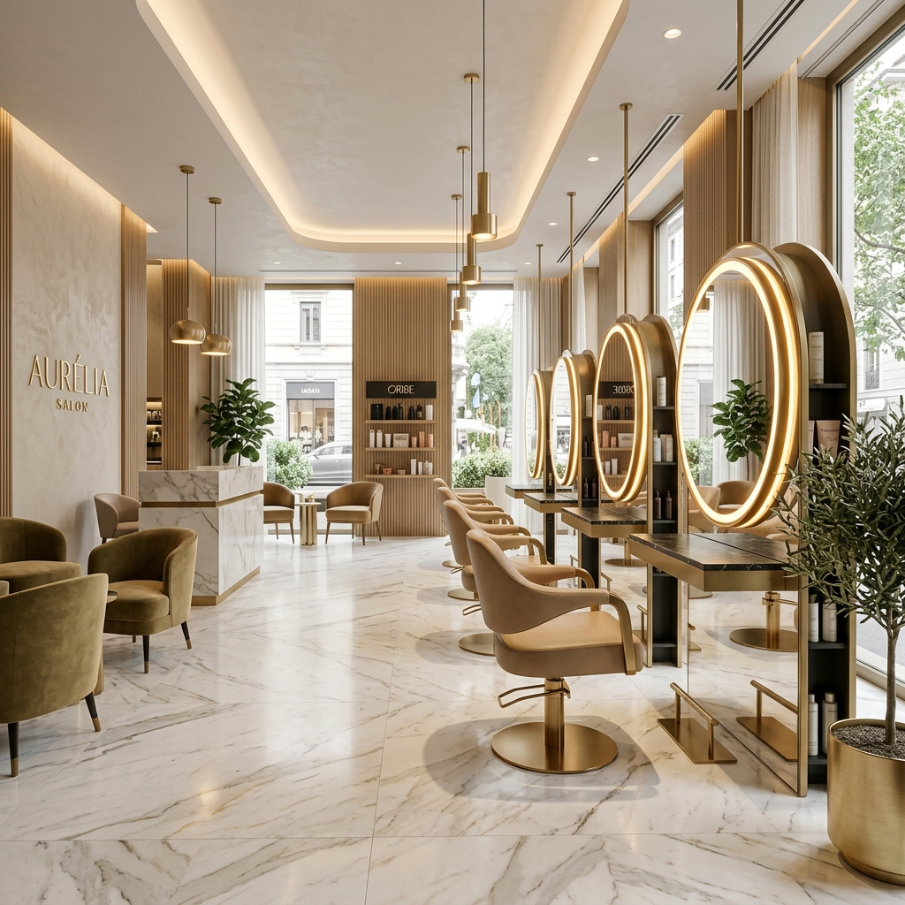

<p align="center">
  
</p>

<h1 align="center">✨ LUXE Salon</h1>

<p align="center">
  <strong>A premium hair & beauty salon website built with modern web technologies</strong>
</p>

<p align="center">
  
  
  
  
  
</p>

---

## 🌟 Overview

LUXE Salon is a premium, responsive website designed to deliver a luxury-grade digital experience. It features smooth scroll animations, glassmorphism UI, dark/light theme switching, and a fully functional contact system.

## 🚀 Tech Stack

| Technology | Purpose |
|---|---|
| **Next.js 16** | React framework with App Router, SSR & API routes |
| **React 19** | UI library with latest concurrent features |
| **Tailwind CSS 4** | Utility-first styling with custom design tokens |
| **TypeScript 5** | Type-safe development |
| **Framer Motion 12** | Scroll animations, page transitions & micro-interactions |
| **Lenis** | Butter-smooth scroll experience |
| **Lucide React** | Beautiful, consistent icon system |
| **next-themes** | Dark/light mode with system preference detection |

## ✨ Features

- **🎨 Premium Design** — Glassmorphism cards, aurora gradients, organic shapes
- **🌗 Dark & Light Mode** — Full theme support with smooth transitions
- **📱 Fully Responsive** — Optimized for mobile, tablet, and desktop
- **🎭 Scroll Animations** — Parallax effects, reveal animations, floating elements
- **⚡ Performance Optimized** — Lazy-loaded sections, dynamic imports, GPU-accelerated animations
- **📧 Working Contact Form** — API-powered form with validation and status feedback
- **📰 Newsletter Signup** — Functional subscription system with API endpoint
- **📞 Clickable Contact Links** — `tel:` and `mailto:` links for instant action
- **🔍 SEO Ready** — Proper meta tags, semantic HTML, heading hierarchy

## 📂 Project Structure

```
luxe-salon/
├── public/
│   └── images/              # Optimized assets
├── src/
│   ├── app/
│   │   ├── api/
│   │   │   ├── contact/     # Contact form API route
│   │   │   └── newsletter/  # Newsletter subscription API route
│   │   ├── globals.css      # Design tokens, theme, utility classes
│   │   ├── layout.tsx       # Root layout with providers
│   │   └── page.tsx         # Main page with lazy-loaded sections
│   ├── components/
│   │   ├── animations/      # Scroll reveals, particles, aurora BG
│   │   ├── sections/        # Navbar, Hero, About, Services, Gallery,
│   │   │                    # Testimonials, Contact, Footer
│   │   └── ui/              # Reusable UI primitives
│   ├── hooks/               # Custom hooks (parallax, etc.)
│   └── lib/                 # Constants, utilities
├── .github/
│   └── workflows/
│       └── ci.yml           # GitHub Actions CI pipeline
├── package.json
├── tsconfig.json
├── tailwind.config.ts
└── next.config.ts
```

## 🛠️ Getting Started

### Prerequisites

- **Node.js** ≥ 18.x
- **npm** ≥ 9.x

### Installation

```bash
# Clone the repository
git clone https://github.com/YOUR_USERNAME/luxe-salon.git
cd luxe-salon

# Install dependencies
npm install

# Start development server
npm run dev
```

Visit [http://localhost:3000](http://localhost:3000) to see the result.

### Available Scripts

| Command | Description |
|---|---|
| `npm run dev` | Start development server with hot reload |
| `npm run build` | Create optimized production build |
| `npm run start` | Serve the production build |
| `npm run lint` | Run ESLint for code quality checks |

## 🎨 Design System

The project uses a custom design token system defined in `globals.css`:

- **Colors**: OKLCH color space for perceptually uniform gradients
- **Typography**: Playfair Display (headings) + Poppins (body)
- **Spacing**: Consistent section containers and elegant spacing utilities
- **Effects**: Glass morphism, liquid glass, aurora gradients, organic shapes

### Theme Tokens

| Token | Light Mode | Dark Mode |
|---|---|---|
| `--background` | Near white | Deep charcoal |
| `--foreground` | Near black | Near white |
| `--accent` | Rich gold | Bright gold |
| `--muted-foreground` | Mid gray | Light gray |

## 🔌 API Endpoints

### `POST /api/contact`
Handles appointment booking form submissions.

**Body:**
```json
{
  "name": "string (required)",
  "email": "string (required)",
  "phone": "string (required)",
  "service": "string (required)",
  "message": "string (optional)"
}
```

### `POST /api/newsletter`
Handles newsletter email subscriptions.

**Body:**
```json
{
  "email": "string (required)"
}
```

> **Note:** Both endpoints currently log to the console. To connect a real email service (SendGrid, Resend, Mailchimp, etc.), update the route handlers in `src/app/api/`.

## 🚢 Deployment

### Vercel (Recommended)

```bash
npm i -g vercel
vercel
```

### Docker

```bash
docker build -t luxe-salon .
docker run -p 3000:3000 luxe-salon
```

## 🤝 Contributing

1. Fork the repository
2. Create your feature branch (`git checkout -b feature/amazing-feature`)
3. Commit your changes (`git commit -m 'Add amazing feature'`)
4. Push to the branch (`git push origin feature/amazing-feature`)
5. Open a Pull Request

## 📄 License

This project is licensed under the MIT License.

---

<p align="center">
  Built with ❤️ using Next.js, Tailwind CSS & Framer Motion
</p>
